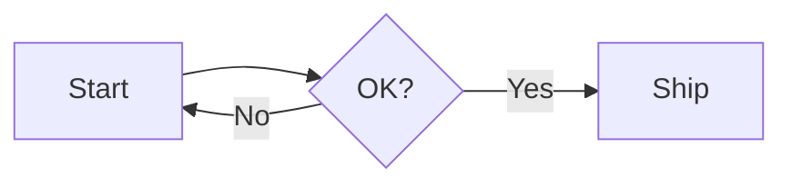

# md2pdf-cli

Convert Markdown files into beautifully styled PDFs using [marked](https://github.com/markedjs/marked), [KaTeX](https://katex.org/) and [puppeteer](https://github.com/puppeteer/puppeteer).

GitHub-flavored Markdown, tables, code blocks, blockquotes, images **and LaTeX math equations** (`$inline$` and `$$display$$`) are all rendered with sane, print-friendly defaults — page numbers in the footer, A4 by default, justified body text, and zebra-striped tables.

## Install

```bash
npm install -g @brahim.ariani/md2pdf-cli
```

Or use it directly in a project:

```bash
npm install brahim.ariani/md2pdf-cli
```

## CLI

```bash
md2pdf <input.md> [output.pdf] [options]
```

If `output.pdf` is omitted, the output filename is derived from the input (e.g. `research.md` → `research.pdf`).

### Options

| Flag                   | Description                                                |
|------------------------|------------------------------------------------------------|
| `--title <text>`       | Document title (defaults to the input filename)            |
| `--css <file>`         | Path to a custom CSS file (replaces the default styles)    |
| `--theme <name>`       | Built-in theme: `default`, `academic`, `latex`             |
| `--format <size>`      | Page format: `A4`, `Letter`, `Legal`, ... Default: `A4`    |
| `--toc`                | Prepend an auto-generated table of contents                |
| `--toc-depth <n>`      | Deepest heading level included in the TOC. Default: `3`    |
| `--toc-title <text>`   | TOC heading text. Default: `Contents`                      |
| `--highlight`          | Syntax-highlight fenced code blocks with Shiki             |
| `--code-theme <name>`  | Shiki theme for code blocks. Default: `github-light`       |
| `--mermaid`            | Render ` ```mermaid ` code blocks as diagrams              |
| `--mermaid-theme <t>`  | Mermaid theme: `base`, `default`, `neutral`, `dark`, `forest`. Default: `base` |
| `--cover`              | Render a title page from YAML front matter                 |
| `--no-cover`           | Never render a title page (overrides front matter)         |
| `--no-page-numbers`    | Disable the page-number footer                             |
| `--no-math`            | Disable KaTeX equation rendering                           |
| `--no-sanitize`        | Disable HTML sanitization (**unsafe**, see below)          |
| `--keep-html`          | Keep the intermediate `.tmp.html` file for debugging       |
| `-h`, `--help`         | Show usage                                                 |

### Examples

```bash
md2pdf research.md
md2pdf research.md out/research.pdf
md2pdf report.md report.pdf --title "Quarterly Report" --css theme.css
md2pdf notes.md notes.pdf --format Letter --no-page-numbers
md2pdf book.md book.pdf --toc --toc-depth 2 --toc-title "Table of Contents"
md2pdf code.md code.pdf --highlight --code-theme github-dark
md2pdf paper.md paper.pdf --cover --toc
md2pdf thesis.md thesis.pdf --theme academic --toc
md2pdf paper.md paper.pdf            # equations rendered by default
md2pdf draft.md draft.pdf --no-math  # treat $...$ as literal text
```

### Math / LaTeX equations

Inline math uses single dollars, display math uses double dollars:

```markdown
The famous identity is $e^{i\pi} + 1 = 0$.

$$
\int_{-\infty}^{\infty} e^{-x^2}\,dx = \sqrt{\pi}
$$
```

Equations are rendered server-side with KaTeX, so the PDF is self-contained and prints identically on any machine.

## Table of contents

Pass `--toc` to prepend an auto-generated, clickable table of contents built
from the document headings. Each heading also receives a stable `id` slug, so
the TOC links resolve as in-document bookmarks.

```bash
md2pdf report.md report.pdf --toc                       # depth 3 (default)
md2pdf report.md report.pdf --toc --toc-depth 2         # only h1 + h2
md2pdf report.md report.pdf --toc --toc-title "Sommaire"
```

The TOC is placed on its own page (it ends with a page break). You can fully
restyle it via `--css` by targeting `nav.toc`, `nav.toc .toc-title`, etc.

## Themes

Pick a built-in look with `--theme`:

| Theme      | Description                                                          |
|------------|----------------------------------------------------------------------|
| `default`  | Clean sans-serif, navy headings, zebra tables (the original look)    |
| `academic` | Georgia serif, justified & indented paragraphs, centered title       |
| `latex`    | Classic LaTeX `article` look: Computer Modern serif, booktabs tables |

```bash
md2pdf report.md report.pdf --theme academic
md2pdf thesis.md thesis.pdf --theme latex --toc
md2pdf design.md design.pdf --mermaid --highlight --cover
```

Every theme keeps the same structural rules (math, TOC, cover page, tables,
page-break safety) and only swaps typography and colors. An unknown theme name
falls back to `default` with a warning. For full control, `--css` still
replaces all styles entirely.

## Front matter & cover page

Markdown files may start with a YAML front-matter block. It is parsed, stripped
from the body, and used to enrich the document:

```markdown
---
title: Quarterly Report
subtitle: Q2 2026 Financial Overview
author:
  - Brahim Ariani
  - Finance Team
date: 2026-05-31
cover: true
---

# Introduction
...
```

- `title` becomes the HTML document title (a `--title` flag still wins).
- With `--cover` (or `cover: true` in the front matter), a dedicated **title
  page** is rendered from `title`, `subtitle`, `author`/`authors` and `date`,
  followed by a page break. `--no-cover` disables it even if the front matter
  requests one.

```bash
md2pdf paper.md paper.pdf --cover
md2pdf paper.md paper.pdf --cover --toc   # title page, then a TOC page
```

Restyle the cover via `--css` by targeting `section.cover`, `.cover-title`,
`.cover-subtitle`, `.cover-author`, `.cover-date`.

## Syntax highlighting

Pass `--highlight` to colorize fenced code blocks with
[Shiki](https://shiki.style/) (the same engine that powers VS Code). Colors are
inlined into the HTML, so the PDF stays self-contained and prints identically
everywhere — no client-side JavaScript or web fonts required.

```bash
md2pdf code.md code.pdf --highlight
md2pdf code.md code.pdf --highlight --code-theme github-dark
```

Only the languages actually used in the document are loaded, keeping conversion
fast. Use any Shiki theme name (e.g. `github-light`, `github-dark`, `nord`,
`dracula`, `min-light`). Unknown languages fall back to a plain, escaped code
block, and an unknown theme falls back to `github-light`.

## Mermaid diagrams

With `--mermaid`, fenced code blocks tagged `mermaid` are rendered into vector
diagrams with [Mermaid](https://mermaid.js.org/) (flowcharts, sequence diagrams,
Gantt charts, etc.):

````markdown

````

```bash
md2pdf design.md design.pdf --mermaid
md2pdf design.md design.pdf --mermaid --mermaid-theme neutral
```

Diagrams are rendered inside the same headless Chromium used for printing, so
the resulting SVG is embedded directly in the PDF — no network access or extra
tooling required. Mermaid runs with `securityLevel: 'strict'`, and a diagram
with invalid syntax is skipped rather than aborting the whole conversion.
Without `--mermaid`, ` ```mermaid ` blocks are left as plain code.

## Security / HTML sanitization

Markdown allows raw HTML, which means an untrusted `.md` file can embed
`<script>`, `<iframe>`, or event-handler attributes (`onerror`, `onclick`, ...).
Because the document is rendered through a real browser (Chromium) before being
printed, such payloads would otherwise execute.

To prevent this, the HTML produced from your Markdown is **sanitized by default**
with [DOMPurify](https://github.com/cure53/DOMPurify) before it ever reaches the
browser. Scripts, event handlers, and dangerous URIs (`javascript:`, ...) are
stripped, while legitimate content — headings, tables, code blocks, images,
links and KaTeX/MathML/SVG math — is preserved.

If you fully trust the input and need to keep raw HTML (custom `<script>`,
embeds, etc.), you can opt out:

```bash
md2pdf trusted.md trusted.pdf --no-sanitize
```

```js
await convert({ input: 'trusted.md', output: 'trusted.pdf', sanitize: false });
```

> Only disable sanitization for content you control. Never run `--no-sanitize`
> on files from untrusted sources.

## Programmatic API

```js
const { convert } = require('md2pdf-cli');

await convert({
  input: 'research.md',
  output: 'research.pdf',
  title: 'My Research Report',
  // cssFile: 'theme.css',
  // css: '/* inline CSS string */',
  format: 'A4',
  pageNumbers: true,
  sanitize: true,
  toc: true,
  tocDepth: 3,
  highlight: true,
  codeTheme: 'github-light',
});
```

### `convert(options)`

| Option              | Type                          | Default                | Description                                            |
|---------------------|-------------------------------|------------------------|--------------------------------------------------------|
| `input`             | `string`                      | —                      | Path to a Markdown file (required)                     |
| `output`            | `string`                      | —                      | Path to the output PDF (required)                      |
| `title`             | `string`                      | input basename         | `<title>` of the generated HTML                        |
| `theme`             | `string`                      | `'default'`            | Built-in theme: `default`/`academic`/`latex`           |
| `css`               | `string`                      | bundled default        | Inline CSS string (overrides `theme`)                  |
| `cssFile`           | `string`                      | —                      | Path to a CSS file (overrides `css` and `theme`)       |
| `format`            | `string`                      | `'A4'`                 | Puppeteer page format                                  |
| `margin`            | `object`                      | 22mm / 18mm            | `{ top, bottom, left, right }`                         |
| `pageNumbers`       | `boolean`                     | `true`                 | Render `n / total` in the footer                       |
| `math`              | `boolean`                     | `true`                 | Render `$...$` and `$$...$$` as KaTeX                  |
| `sanitize`          | `boolean`                     | `true`                 | Sanitize generated HTML (strip scripts/handlers)       |
| `toc`               | `boolean`                     | `false`                | Prepend an auto-generated table of contents            |
| `tocDepth`          | `number`                      | `3`                    | Deepest heading level included in the TOC              |
| `tocTitle`          | `string`                      | `'Contents'`           | TOC heading text                                       |
| `highlight`         | `boolean`                     | `false`                | Syntax-highlight code blocks with Shiki                |
| `codeTheme`         | `string`                      | `'github-light'`       | Shiki theme name for code blocks                       |
| `mermaid`           | `boolean`                     | `false`                | Render `mermaid` code blocks as diagrams               |
| `mermaidTheme`      | `string`                      | `'base'`               | Mermaid theme name (light by default)                  |
| `cover`             | `boolean`                     | front matter           | Render a title page (`true`/`false` overrides YAML)    |
| `headerTemplate`    | `string`                      | empty                  | Puppeteer header HTML                                  |
| `footerTemplate`    | `string`                      | page numbers           | Puppeteer footer HTML                                  |
| `puppeteerOptions`  | `object`                      | `{}`                   | Extra options passed to `puppeteer.launch`             |
| `keepHtml`          | `boolean`                     | `false`                | Keep the intermediate `.tmp.html` file                 |

Returns `{ output, brokenImages }` where `brokenImages` lists any `` URLs that failed to load.

## Requirements

- Node.js >= 18
- Puppeteer will download a compatible Chromium on install (≈ 170 MB). To skip this and reuse an existing Chrome, set `PUPPETEER_SKIP_DOWNLOAD=true` before installing and pass `puppeteerOptions: { executablePath: '...' }` to `convert()`.

## License

MIT
