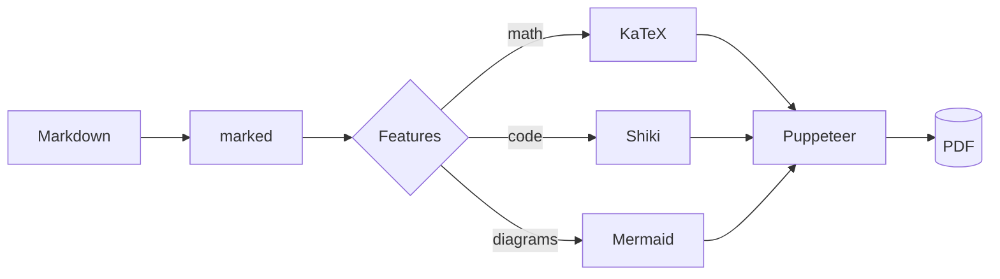
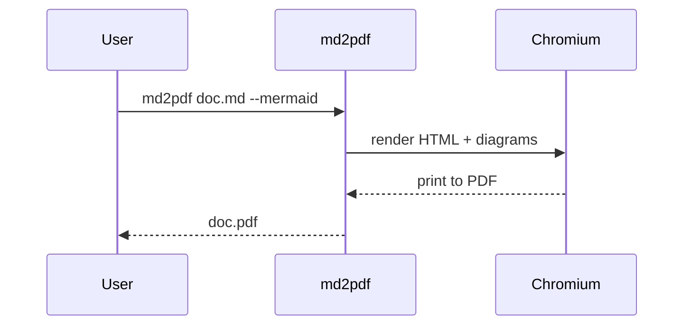

# Introduction

This document exercises **every** feature of `md2pdf-cli`: a YAML front-matter
cover page, an auto-generated table of contents, syntax highlighting, Mermaid
diagrams, KaTeX equations, GitHub-flavored tables and more.

Run it with all the bells and whistles:

```bash
md2pdf sample.md sample.pdf --cover --toc --highlight --mermaid --theme default
```

## Text formatting

GitHub-flavored Markdown is supported: **bold**, *italic*, `inline code`,
~~strikethrough~~, and [links](https://github.com/brahimariani/md2pdf-cli).

- Bullet lists
- With several items
  - And nested levels
- Back to the top level

1. Ordered lists
2. Work too
3. As expected

> Blockquotes are styled per theme — try `--theme academic` or `--theme latex`
> to see how the typography changes.

## Tables

| Tool         | Role                       | Optional |
|--------------|----------------------------|:--------:|
| marked       | Markdown parser            |    No    |
| puppeteer    | Headless Chrome / PDF      |    No    |
| KaTeX        | Math rendering             |   Yes    |
| Shiki        | Syntax highlighting        |   Yes    |
| Mermaid      | Diagrams                   |   Yes    |

## Syntax highlighting

With `--highlight`, fenced code blocks are colorized by Shiki:

```js
const { convert } = require('@brahim.ariani/md2pdf-cli');

async function main() {
  await convert({
    input: 'sample.md',
    output: 'sample.pdf',
    toc: true,
    highlight: true,
    mermaid: true,
  });
}

main().catch((err) => console.error(err));
```

```python
def fib(n: int) -> int:
    a, b = 0, 1
    for _ in range(n):
        a, b = b, a + b
    return a
```

## Diagrams

With `--mermaid`, fenced `mermaid` blocks become vector diagrams:



A sequence diagram works as well:



## Equations

Inline math: Euler's identity is $e^{i\pi} + 1 = 0$.

Display math:

$$
\int_{-\infty}^{\infty} e^{-x^2}\,dx = \sqrt{\pi}
$$

$$
\mathbf{y} = \sigma\!\left(\mathbf{W}\mathbf{x} + \mathbf{b}\right)
$$

## Conclusion

If you can read this PDF — with a cover page, a clickable table of contents,
highlighted code, rendered diagrams and typeset equations — every feature is
working as intended.
